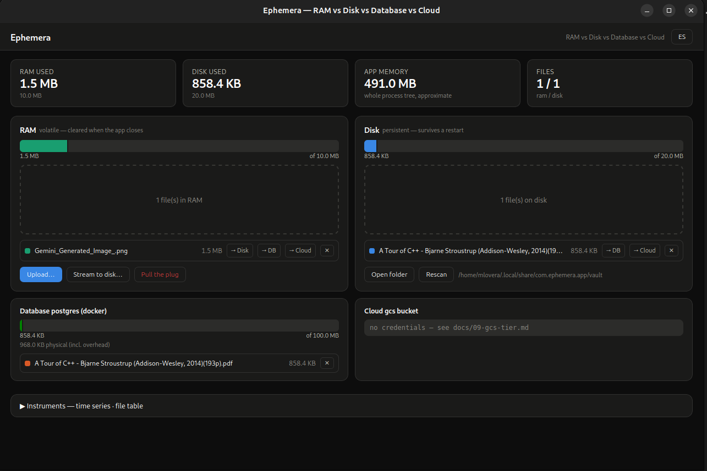

# Ephemera

> A desktop app that teaches the storage hierarchy — **RAM, disk, database, and cloud**
> — by making you feel it. Files you upload live *only* in RAM until you deliberately
> carry them somewhere durable.

**Status:** working app, natively rendered with [Slint](https://slint.dev) — UI and core
run in one process, one address space, no webview. RAM, disk, database (Postgres), and
cloud (GCS) tiers are all implemented and tested; CI is green. Full design spec lives in
[`docs/`](docs/).

**Just want to run it?** → [**DOWNLOAD.md**](DOWNLOAD.md) — prebuilt Linux x86_64
binaries, plus build-from-source guides for Windows, macOS, and other architectures.



## Running it

```bash
docker compose up -d                   # postgres, for the database tier
cp crates/ephemera-app/.env.example crates/ephemera-app/.env  # fill in GCS_BUCKET if you have one — see docs/09-gcs-tier.md
cd crates/ephemera-app && cargo run --release   # or: make dev
```

The RAM and disk tiers work with zero setup. The database tier needs Postgres running
(`docker compose up -d`); the cloud tier needs a GCS service-account key at
`crates/ephemera-app/gcs-key.json` (see [`docs/09-gcs-tier.md`](docs/09-gcs-tier.md)).
Both degrade to an "offline" panel rather than breaking the app if unavailable.

There is no dev-server/release-build split anymore — Slint's UI compiles directly into
the binary, so `cargo run` and the release build behave the same, just at different
optimization levels.

```bash
cd crates/ephemera-app && cargo build --release
./target/release/ephemera-app   # or: make run
# or both in one step:
make release
```

```bash
(cd crates/ephemera-core && cargo test)
(cd crates/ephemera-app && cargo test)   # unit + real Postgres/GCS integration
```

## Docs

| Doc | What it answers |
| --- | --- |
| [`docs/00-vision.md`](docs/00-vision.md) | What Ephemera is and why it exists |
| [`docs/01-requirements.md`](docs/01-requirements.md) | Exactly what it must do; the hard limits |
| [`docs/02-architecture.md`](docs/02-architecture.md) | Rust backend, state model, IPC surface, events |
| [`docs/03-ui-and-visualization.md`](docs/03-ui-and-visualization.md) | Two-pane layout, drag & drop, every chart |
| [`docs/04-tech-stack.md`](docs/04-tech-stack.md) | Chosen libraries with rationale + verified machine prereqs |
| [`docs/05-teaching-notes.md`](docs/05-teaching-notes.md) | The CS concepts, and which UI element teaches each |
| [`docs/06-open-questions.md`](docs/06-open-questions.md) | Decisions still needed before/during build |
| [`docs/07-streaming.md`](docs/07-streaming.md) | The RAM-bypass streaming path and its report |
| [`docs/08-database-tier.md`](docs/08-database-tier.md) | Postgres/Docker binary storage tier |
| [`docs/09-gcs-tier.md`](docs/09-gcs-tier.md) | Cloud tier + full GCP setup guide |
| [`docs/10-implementation-status.md`](docs/10-implementation-status.md) | What's actually built vs. spec, and known deviations |

## The idea in one paragraph

Ephemera looks like a stripped-down Google Drive with two panes. The left pane is
**RAM** — drop files in and they are held as bytes in the Rust process heap, capped at
**10 MB**, and they are gone the moment the app exits. The right pane is **Disk** — a
single folder you configure, capped at **20 MB**, whose contents survive anything. The
only way a file crosses from left to right is an explicit action. Around those two panes
sits a live dashboard: per-store usage meters broken down by file, a real-time memory
graph that moves while you upload, transfer throughput for each direction, and the
process's *actual* resident memory so you can see how much the app itself costs beyond
the bytes you stored.

## Name

*Ephemera* — things that exist for only a short time. The RAM pane is the ephemera; the
whole app is about what it takes to make something last.
